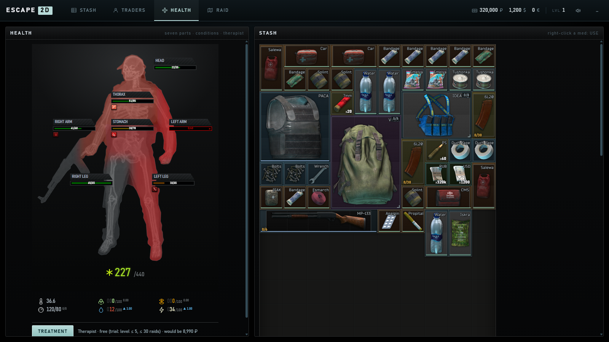
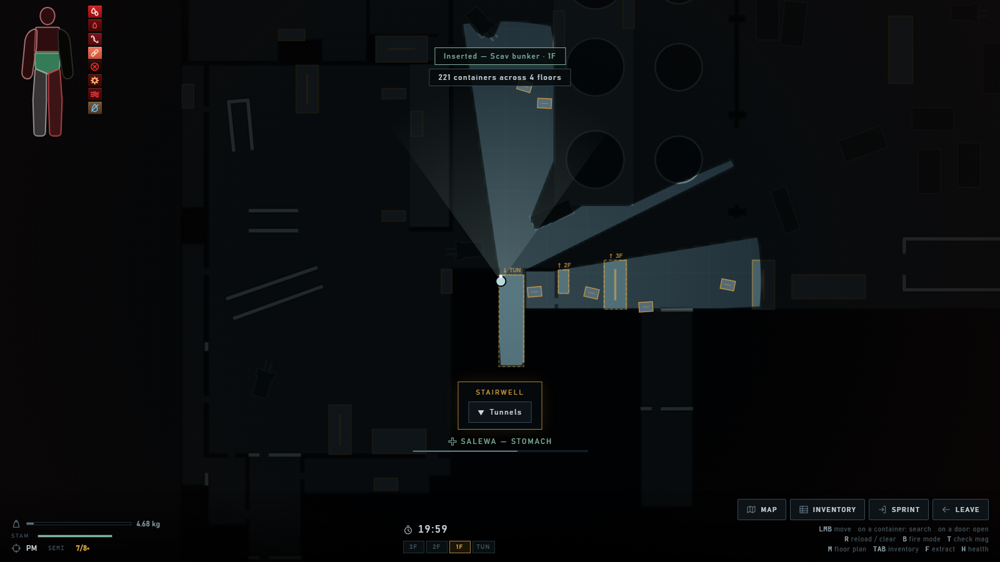
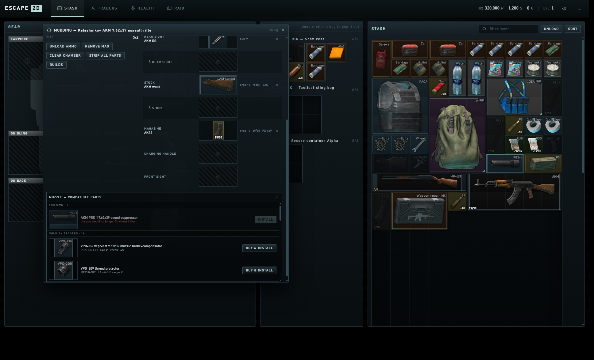
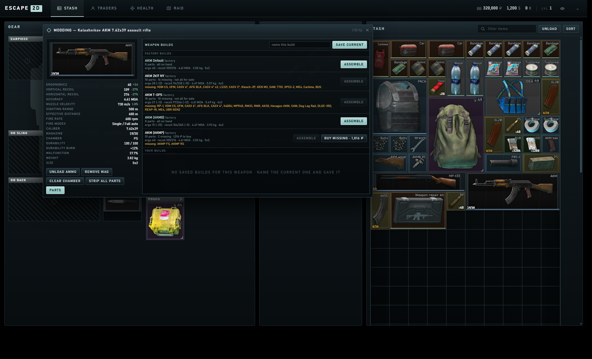
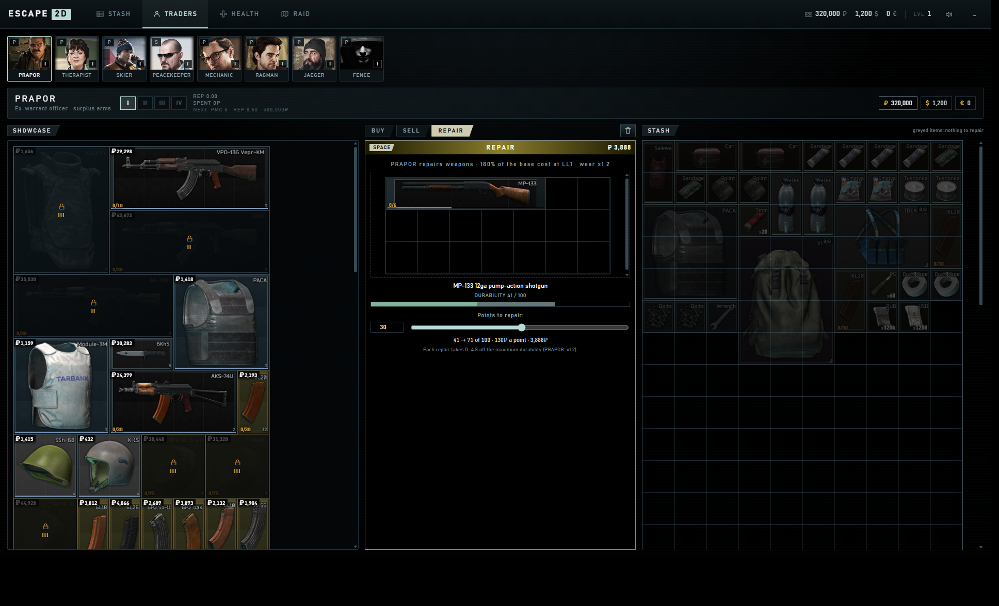
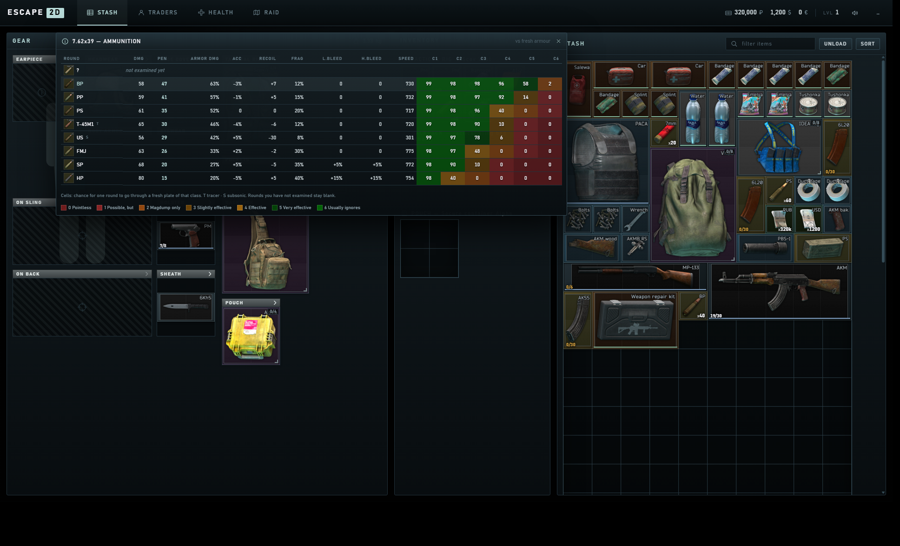
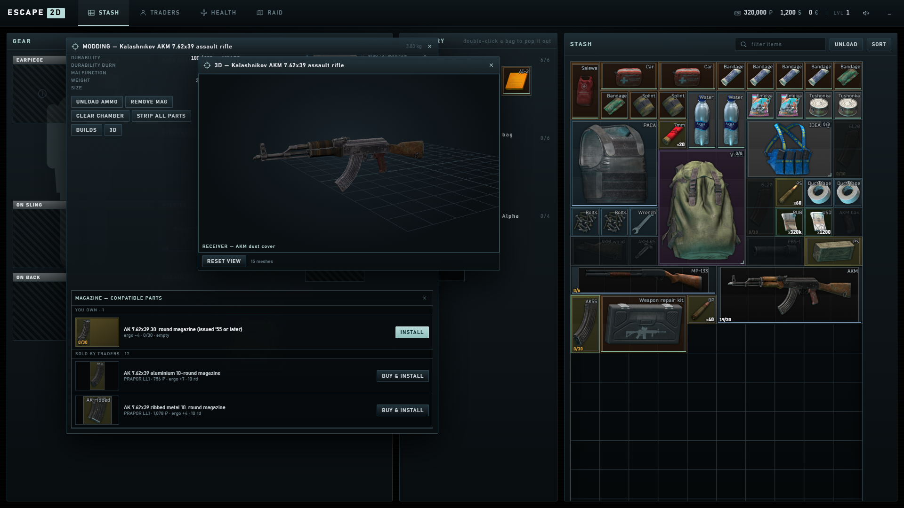

# ESCAPE 2D — Factory

A top-down, browser-based extraction shooter sandbox built around a faithful
reimplementation of Escape From Tarkov's grid inventory. Click to move, click a
container to search it, drag the loot into your rig, then walk to an exfil and
hold the button to take it home. Mouse only — the keyboard is optional.

**Play it: https://ysh4267.github.io/escape-2d/**

No build step, no dependencies — plain ES modules, canvas and DOM.

| | |
|---|---|
|  |  |
| in raid — fog of war over the real Factory geometry | searching a dead scav; unexamined loot shows as `?` |
|  |  |
| the plan of the storey you are on — press `M`, or walk up a staircase and it follows | pre-raid brief |
|  |  |
| eight traders, loyalty-gated stock, three currencies | the stash |
|  |  |
| the HEALTH tab — seven parts, conditions, the Therapist | in raid: the doll in the corner, a Salewa going onto the stomach |

---

## Playing

Everything is playable with the mouse alone.

| | |
|---|---|
| **left click** the ground | move there (A\* pathfinding around the real Factory walls) |
| **left click** a container | walk to it and search it |
| **left click** a hostile | open fire; hold to keep shooting |
| **left click** a door | open it, unlock it if you have the key, or force it |
| **left click** a staircase | walk to it; the prompt offers the floors it reaches |
| **wheel** | zoom |
| **MAP / INVENTORY / SPRINT / LEAVE** buttons | bottom-right of the raid HUD |
| hold the **exfil panel** | channel the extraction |

Optional keyboard shortcuts still work: `TAB` inventory, `H` health, `M` floor
plan, `SHIFT` sprint, `F` extract, `ESC` leave, `1/2/3/4` for the hideout tabs.

Doors mostly look after themselves — walk into a shut one and you open it on
the way through. Four on Factory want a key, and one wants a shoulder.

### Inventory

| | |
|---|---|
| **drag** | move an item; the ghost anchors by its **top-left** cell, as in Tarkov |
| **right click while dragging** | rotate 90° (`R` also works; square items are a no-op) |
| **double click** a bag, rig or case | pop it out into a draggable window you can drop items into |
| **double click** anything else | quick transfer |
| **right click** an item | context menu: open, examine, use, split, equip, inspect, discard |
| **ctrl + click** | quick transfer — rig, then pockets, then backpack |
| **ctrl + drag** onto a free cell | split the stack |
| **alt + click** | equip into the matching slot |

Two panels, as in the game. GEAR is the character screen, laid out the way the
real one is — earpiece, headwear and face cover across the top, body armour and
eyewear beneath, the two long-gun bars spanning the first two columns with the
holster and sheath beside them, and the rig, pockets, backpack and pouch in
their own column. INVENTORY next to it is where the rig and the bags open up so
you can actually shuffle loot.

---

## What is modelled

**Grid inventory.** Items occupy `w × h` cells, never overlap, and rotate 90°.
Grid-to-grid drops onto occupied cells are rejected outright — Tarkov has no
grid swap; only equipment slots swap. Stacks merge up to the template's real
`StackMaxSize` and a found-in-raid stack never launders a non-FiR one.

**Containers.** Every container carries its real internal grid layout, so a
BlackRock rig really is seven separate pouches and a Documents case really is
1×2 outside and 4×4 inside, filtered to keys, intel and money. Nesting is
blocked for cycles (an item inside itself), for backpack-in-backpack, and past
a depth cap.

**Equipment.** Headwear, earpiece, face cover, eyewear, body armor, tactical
rig, backpack, secure container, on-sling, on-back, holster and sheath, plus
**four independent 1×1 pockets** — the real base-PMC layout, so nothing larger
than a single cell fits in a pocket and items never span two of them.

**Weapons are built out of parts.** Every gun carries the real template's mod
slots — gas block, handguard, muzzle, pistol grip, dust cover, rear sight,
stock, magazine, charging handle, mounts — and every part that goes into any
of them is in the game: 610 parts, 46 magazines and 61 cartridges, generated
as the transitive closure of the twelve guns' `Slots` filters, so a dovetail
mount brings the scopes that mount on it and the AK buffer-tube adapter brings
the AR stocks. Slot filters, `ConflictingItems`, required (vital) parts and the
`ExtraSize` each part adds to the gun's footprint are all the template's own; a
built AK-74N is 5×2, strip the stock and it is 4×2, fold the AKS-74U and it is
3×2, and every one of the twelve default builds lands on exactly the size of
tarkov.dev's preset sprite. A gun that will not fit where it lies refuses the
part. Guns bought or found come assembled to their default preset (globals.json
`ItemPresets`), worn inside the template's spawn range and, often, part loaded.

The modding screen (right-click → MODDING, or double-click a gun) is a floating
panel: the assembled gun and its numbers on the left, the slot tree on the
right. Slots are real drop targets, so a part is dragged out of the stash onto
the slot it goes in; clicking an empty slot lists every compatible part you
own; the cross beside a part takes it off. Ergonomics is the sum, recoil and
muzzle velocity are percentage sums applied to the base, accuracy is
`CenterOfImpact` turned into MOA (radius, the game's own quirk), sighting range
comes off the best sight fitted. In raid, vital parts (`RaidModdable: false`)
stay put.

**Magazines hold cartridges.** A magazine is an ordered list of runs — the
round loaded last comes out first, exactly as in the game — and it will only
take what its `Cartridges` filter allows. Drag a stack of rounds onto a
magazine (or onto a gun) to load it, right-click → LOAD AMMO to pick the round
and the count, UNLOAD AMMO to get them back as stacks; a shotgun's tube is a
magazine like any other. Guns with a chamber keep one round in it, and firing
takes the chambered round first and cycles the next one in. Loaded magazines
weigh what their rounds weigh and sell for what they are worth.

Cartridges carry the full ballistic card — damage, penetration, armour damage,
fragmentation (and how many fragments), velocity and whether it is subsonic,
recoil and accuracy modifiers, bleed chances, tracer, misfire and feed-failure
chance, durability burn and heat — read straight from the template, plus a
strip of the round's chance to go through a fresh plate of each armour class,
on the penetration curve every calculator quotes off the client (`90%` at the
plate's value, nothing fifteen under it). Right-click a round → CALIBER CHART
for the wiki's table of every round of that calibre you have examined, coloured
on the wiki's own six-step scale. What those numbers do to a shot is the next
pass; for now a round's own damage is what lands.

**Ammo packs and cases.** The 86 ammo packs (every `AmmoBox` whose round we
carry — the 120-round 5.45 PS pack, the 20-round 7.62x39 boxes, the 16 and 50
of 9x18, the 25 of 12/70) are items of their own, priced as their rounds and
unpacked (right-click → UNPACK) into stacks; the ammo case and the two weapon
cases (5×10 and 6×15 inside) file them as ammunition.

**Builds.** BUILDS in the modding screen is the game's weapon-presets panel:
the factory's builds of the gun (the default, and the alternates globals.json
carries — the AKMB and AKMP, the 2k17 New Year AKM, the "Tactical" MP-133,
the NERFGUN Saiga, the Brunner TT) and the ones you save under a name. Each is
planned against what you own — parts already on the gun stay, loose parts in
the stash go on, what is missing is listed with what the traders ask for it
and can be bought in one go — previewed (ergonomics, recoil, MOA, weight, size)
and ASSEMBLE takes the gun to exactly that tree, the parts that do not belong
coming off into the stash. A slot's picker also lists what the traders sell
for it, with BUY & INSTALL; while a slot is picked, the stash dims everything
that does not fit it.

**Repair.** A gun's ceiling is its own (`Repairable.MaxDurability`), and every
repair grinds a little off it. Prapor, Skier and Mechanic have a REPAIR tab: a
gun on the bench, a slider for the points, the price is the weapon's
`RepairCost` × points × the trader's `repair_price_coef` for your loyalty
level (Prapor 80–100%, Skier 110–140%, Mechanic 175–195% on top of the base),
and the wear on the ceiling is a roll in the template's
`Min/MaxRepairDegradation` (0–4%) times the trader's `quality` — Prapor cheap
and rough (×1.2), Mechanic dear and careful (×0.7). The Weapon repair kit
(1000 resource, 0.5 a point, its own 0–3.5% wear) does the same from the stash:
right-click a worn gun → REPAIR WITH KIT, or the kit → USE ON WEAPON. Scav
guns come with a worn ceiling (85–100, and 30–45 under it), as the server rolls
them.

**The gun in three dimensions.** 3D in the modding screen opens the assembled
weapon built from its own meshes: the receiver and every part hung on it at
the transform of the slot it sits in, the same tree the modding screen edits,
so it re-assembles as parts go on and come off (a folded side-folder folds).
Drag to turn, wheel to zoom, right-drag to pan; hover a part to name it, click
it to pick its slot in the modding screen, drag a part from the stash onto the
view and it goes into the nearest slot that takes it. All twelve guns and all
654 parts and magazines have a model — 9 MB of quantised meshes and 256 px
diffuse maps in 666 sealed packs, loaded one item at a time
(`tools/extract_tarkov_models.py`); the slot transforms come out of the same
prefabs, so a suppressor sits on the muzzle where the game puts it.

| | |
|---|---|
|  |  |
| the modding screen — a slot picked, the stash dimmed to what fits it, the traders' offers for the slot | BUILDS — factory and saved builds, planned against the stash |
|  |  |
| Prapor's bench | the 7.62x39 chart |
|  | |
| the AKM in 3D, beside its modding screen | |

**The plant, all four storeys of it.** Tunnels, ground floor, the locker level
and the rafters, each with its own walls, walkable surface, machinery and
staircases, lifted out of the four floor groups in tarkov.dev's vector map.
Thirty-three stairwells link them; a run that shows up on two floor groups is
one staircase seen from both ends, which is how the links are derived rather
than placed. A staircase that passes a floor without a landing does not offer
to stop there.

**Doors, and which of them open.** Nothing hand-places these. The build tool
rasterises each floor exactly as the nav grid does, measures how far every
point is from the nearest solid, then floods the surface widest-first: the
first cell to join two rooms that have both already grown is the narrowest
point of the passage between them. That finds 81 openings across the four
floors, doorways and gateways alike. Anything under 1.6 units of clear width
gets a leaf that starts shut, the way Factory's do.

Which of them are locked is not guesswork either. Factory has exactly four
locked doors, and tarkov.dev's dataset records each one's position and the key
that answers it. Converted into map units, all four land within a metre of an
opening the passage search had already found on its own, knowing nothing about
them — the emergency exit door out to the Med Tent Gate, the cellars door in
the tunnels, the third-floor locked office (all three: **Factory emergency exit
key**) and the TerraGroup storage room beside the camera bunker door
(**TerraGroup storage room keycard**). A key loses a use per door it opens and
breaks when it runs dry.

The fifth special door is the third floor's **breach room**: locked, with no
key anywhere in the game. It is forced, loudly, over a couple of seconds — the
same way it is in the real thing, and the reason the room is called that.

**Floor plan.** `M` opens the plan of the storey you are standing on, drawn
from the same geometry: rooms, named areas, doors coloured by whether they will
open for you, stairwells with the floors they reach, the exits, and every
container you have actually laid eyes on. Walk up a staircase and the plan
follows you; the strip along the top reads any other floor without leaving the
one you are on.

**Raids.** Loot is not scattered. All 167 static containers Factory has are
placed where the game places them, with the type the game gives them, and the
144 loose-loot spots spawn the item recorded for them, some of the time. PMC
insertion uses the map's own 85 player spawn points.

**Searching and examining.** Opening a container does not show you what is in
it. The container is searched, and it gives up its contents **one item at a
time** — matching the real game, where the Attention skill is raised per item
uncovered and its elite perk is a chance to find an item instantly. Nothing you
have not uncovered can be picked up, and walking away cancels the search.

Uncovering an item is not the same as identifying it. 27 of the 195 templates —
keys, rare electronics, high-value gear — are not `ExaminedByDefault`, so they
come out as a hatched **Unknown item** plate. Examining runs on its own timer,
one at a time, and is learned per profile: examine one LEDX and every LEDX you
ever find is recognised. Right-click or double-click to examine.

**Scavs.** Seven hostiles patrol the navmesh and notice you inside a view cone
with clear line of sight, then close to a firing distance and shoot. Your
weapon draws ammunition of the matching caliber from whatever you are carrying,
your armor soaks a share of incoming damage and wears down doing it, and a dead
scav leaves a searchable body with its own gear in it.

**The body.** Seven body parts at the game's own sizes — head 35, thorax 85,
stomach 70, arms 60, legs 65, 440 in all — and a round lands on one of them,
weighted the way hits spread on a standing target. Body armour covers the
thorax and stomach, a helmet the head. A destroyed head or thorax is death; a
destroyed limb passes a share of what hits it on to the rest of the body
(0.49× for an arm, 0.7× a leg, 1.05× the stomach) and comes back only under a
surgical kit, at 1 hp and a lowered ceiling for the raid. Hits roll for light
and heavy bleeding and for fractures on the game's own probability curves
(`globals.json`); every bleed drains every live part on its own clock (0.8 hp
per 6 s light, 0.9 per 4 s heavy) and energy with it, a fracture is a limp at
55% that will not sprint or an arm that shoots and searches slower, pain pulls
the aim off and pulses the view, thirty seconds of it untreated brings a
tremor that shakes the screen, a round ringing off the helmet muffles the
world. Energy and hydration burn on the game's existence rates (five times as
fast with the stomach gone) and hit zero into exhaustion and dehydration.

Medicine reads its own template: a Salewa is 3 s a use, 85 hp a use, and
spends 45 of its 400 to stop a light bleed and 175 for a heavy one, leaving a
fresh wound that a sprint can tear open again; a bandage takes light bleeding
only, a tourniquet or CALOK heavy; splints set fractures; a CMS puts a
destroyed part back at 25–45%, the Surv12 at 60–72%; painkillers hide pain
and fractures for their listed minutes and let you sprint on a broken leg
(which hurts it); Zagustin stops all blood loss for three minutes, Propital
regenerates a point a second for five and shakes your hands at the end,
adrenaline is stamina. Right-click a med, USE, pick the part on the body
doll — the parts it can help are lit, the rest say why not — and the use runs
on the raid clock: walk if you like, but a sprint or a shot interrupts it.
Rations and drinks restore energy and hydration by their `effects_health`.

The HUD carries the doll in the corner, coloured part by part, with the
conditions in a row under it and a timer on the ones that run out; `H` (or the
inventory) opens the full block above the gear. What you bring home is what
you had at the exit — bleeds and fractures included — and it mends on its own
in the HEALTH tab at the game's off-raid rates (7.6 hp a minute over the
body, a light bleed dries up in ten minutes, a heavy one in fifteen), or the
Therapist treats it at 30 ₽ an hp plus 400 / 1200 / 1000 for a light bleed,
a heavy bleed, a fracture — free until level 5 and thirty raids. Death or a
walk-out puts every part back at 30%.

**Extraction.** Anything carried into a raid loses its found-in-raid mark on
insertion; anything carried out gains it. Die or run the clock out and only the
secure container comes home. What you carry out stays exactly where you packed
it — the rig, backpack and pouch come home loaded, and emptying them is the
UNLOAD button in the stash rather than something the result screen does for
you.

**Sound.** 210 cues over three buses — world foley, interface, ambience —
covering footsteps by gait, per-material container rummaging, item handling
keyed to what the item *is*, interface and trader clicks, weapon reports, and
weapon handling: each family's own magazine seating and bolt (the AK's, the
Makarov's slide, the MP-133's shells going into the tube), folding stocks, the
cartridge presses of loading and unloading, and the modding screen's own
install clicks split the way the game splits them (vital / functional / gear).

The audio is third-party, so it ships sealed: a build step deflates the 195
clips into a single AES-256-GCM container, and only that container is tracked —
196 files and 2143 KiB become one request of 1557 KiB. The page unseals it on
load.
The seal is nominal, not protection: a static site has to carry the key, so it
is right there in the source. What it buys is that the pack is not a folder of
ready-to-play files. Any cue with no sample behind it is a silent no-op.

The mapping follows the game's own taxonomy rather than one invented here:
footsteps are `<gait>_<surface>` layered with a `gear_stereo` webbing rustle,
looting uses all ten of the game's rummage loops, one per material (`woodbox`,
`industrialbox`, `safe`, `drawer_wood`, `drawer_metal`, `cashregister`,
`sportbag`, `techno_box`, `jacket`, body), and item foley comes from each
template's own `ItemSound` value — the field the real game keys off, carried
through into `src/data/items-db.json` by the item builder — so a pill bottle
rattles, a bandage rustles and a helmet lands like a helmet, rather than every
item in a category sharing one guessed sound. Mute lives in the top bar,
volume in the profile panel.

**Traders.** Eight traders with the documented buy-back multipliers — Therapist
0.51, Ragman 0.50, Jaeger 0.48, Mechanic 0.45, Prapor 0.40, Skier 0.39,
Peacekeeper 0.36, Fence 0.24 — category gating so most items have only two or
three legal buyers, loyalty levels gated on PMC level, reputation *and* money
spent, and separate rouble / dollar / euro balances. The screen is laid out
like the in-game one: portrait tabs with the loyalty numeral, the assortment
packed into an item grid with price captions, lock plates over higher-tier
offers and per-restock stock counters.

Both sides of a deal go through the trading table rather than completing on a
click. Picking an offer *stages* it — several can sit on the table at once,
each with its own quantity and line total — then the payment has to be
allocated with **Fill items** before **DEAL!** commits the lot in one
transaction. Selling mirrors it: drag items over, each carries what the trader
will pay for it, then DEAL!. The sell table is cut to whatever the middle
column has room for — every cell on screen, nothing to scroll — and is cut
again when the window changes. Neither side pops a confirmation; staging is the
confirmation, which is how the real screen works. Unexamined items and
non-empty containers are refused, what the trader will not buy is greyed out,
and the blocked states use the game's own wording. Fence rerolls his stolen
goods for a fee.

---

## Running it

Any static server works:

```sh
python -m http.server 8777
# then open http://127.0.0.1:8777/
```

`file://` will not work — the game loads its data with `fetch`.

---

## Tools

| file | what it does |
|---|---|
| `tools/build_items.py` | builds `src/data/items-db.json` and downloads item artwork |
| `tools/selection.py` | the curated item list the builder resolves |
| `tools/weapons_expand.py` | expands the guns in the selection into every part, magazine and cartridge they can take, and reads the modding numbers, ballistics, repair numbers, the default and alternate factory presets, the ammo packs, the repair kit and the weapon cases |
| `tools/build_map.py` | extracts all four Factory storeys, finds every opening in them, derives the stairwell links, and folds in tarkov.dev's exits / locks / spawns / loot spots — all into `src/data/map-factory.json` |
| `tools/pack_sfx.py` | compresses and seals the sound pack (and `--unpack` reverses it) |
| `tools/extract_tarkov_models.py` | reads every weapon's and part's prefab out of the installed client — meshes, diffuse maps, the `mod_*` slot transforms — and writes one sealed, quantised pack per item plus `src/data/models-index.json` |
| `tools/verify3d.py` | opens the 3D viewer in a real-time headless Chromium (Playwright — the sealed packs need WebCrypto, which the virtual-time headless runs never finish) and asserts the gun assembles, a click on a part picks its slot, and a part dropped on the view is fitted |
| `tools/sfx_picks.py` | which clip backs which cue |
| `tools/smoke.html` | headless assertion suite over inventory, map, raid, search, examine, trader and save logic |
| `tools/ui-smoke.html` | drives the real game in an iframe with synthetic pointer and key events, asserting the trader screen, drag & drop, menus, modals and the character screen's layout behave |
| `tools/preview_map.html` | `?level=…` renders the raw extracted geometry for one storey |
| `tools/preview_nav.html` | `?level=basement\|ground\|second\|third` — navmesh components, spawn/extract reachability, doors, stairwells and per-area walkability |
| `tools/sfx_test.html` | checks the shipped effects are served and that the audio surface is what the game calls |

Regenerate everything:

```sh
cd tools
python build_items.py --report
python build_map.py
```

The item builder joins three public data sets: grid footprints, weights, stack
sizes and container layouts come from the SPT template dump, English names and
descriptions from the SPT locale dump, base prices and categories from the SPT
handbook, and artwork from `assets.tarkov.dev` — whose grid images are exactly
`63 × cells + 1` pixels, which the builder uses to cross-check every footprint.

---

## Data sources and attribution

This is a non-commercial fan project. Escape From Tarkov is a trademark of
Battlestate Games; this project is not affiliated with or endorsed by them.

- **Map geometry** — [the-hideout/tarkov-dev-svg-maps](https://github.com/the-hideout/tarkov-dev-svg-maps),
  licensed **CC BY-NC-SA 4.0**. All four of Factory's storeys — walls, floors,
  obstacles, reactor units and staircases — are derived from that vector map,
  and so are the openings between them.
- **Raid contents** — `json.tarkov.dev/regular/maps`, the dataset the
  [tarkov.dev](https://tarkov.dev) map page reads. It supplies the exits and
  their factions, the transits, the four locked doors and the key each one
  wants, the 85 player spawn points, the 167 static container spots and the
  144 loose-loot spots, all in the game's own coordinates.
- **Item artwork** — `assets.tarkov.dev`, from the same project.
- **Item templates, names and handbook prices** — the public
  [SPT](https://github.com/sp-tarkov/server) database dumps.
- **What the places are called, and door behaviour** — the Escape From Tarkov
  wiki.
- **Sound effects** — third-party audio whose rights stay with their owner. It
  ships sealed.
- **3D models** — the weapons' and parts' meshes and diffuse textures are
  third-party art whose rights stay with their owner. They ship sealed, one
  pack per item, and are drawn with [three.js](https://threejs.org) (MIT,
  vendored in `assets/vendor/`).

Because the map geometry is CC BY-NC-SA, this project inherits the same terms:
share alike, non-commercial, with attribution.

### Disclaimer

That licence covers only what the authors made, not the third-party material
above. The sealed pack is encrypted because its contents are not ours to hand
out; the key is in the source only because the page needs it, and that is not
permission to use it. **Unseal the pack for anything but playing this game, or
reuse and redistribute any of this in any form, and you do so at your own
risk** — clearing the rights is yours to do, and the authors carry no liability
for what follows. Provided as is, without warranty.

Full text in [LICENSE](LICENSE).
