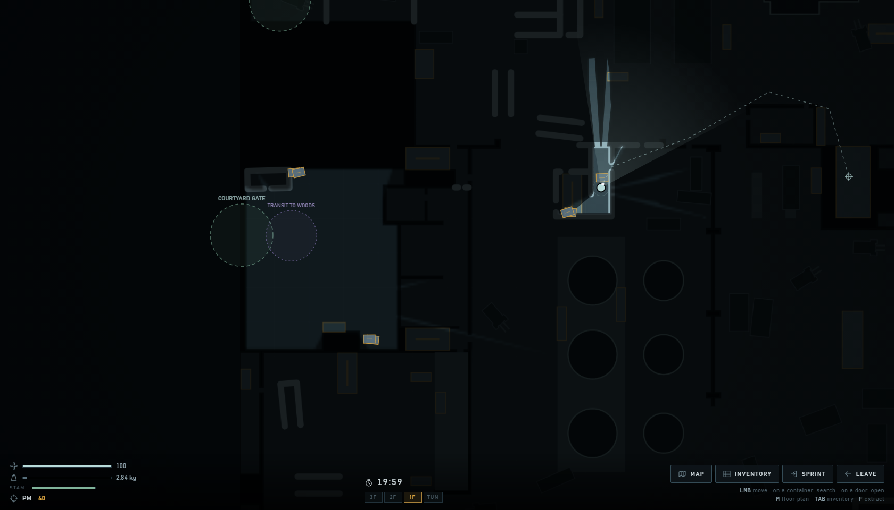
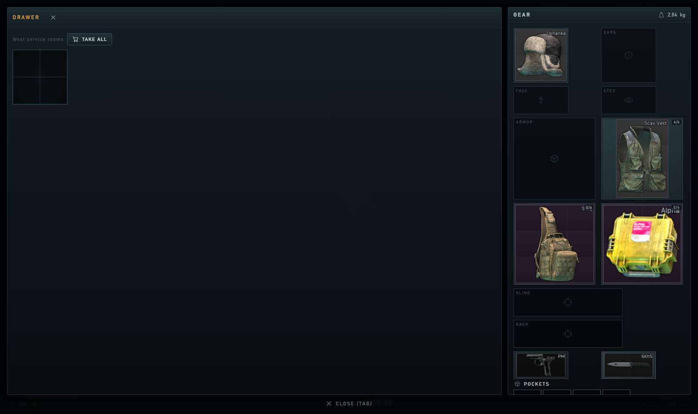
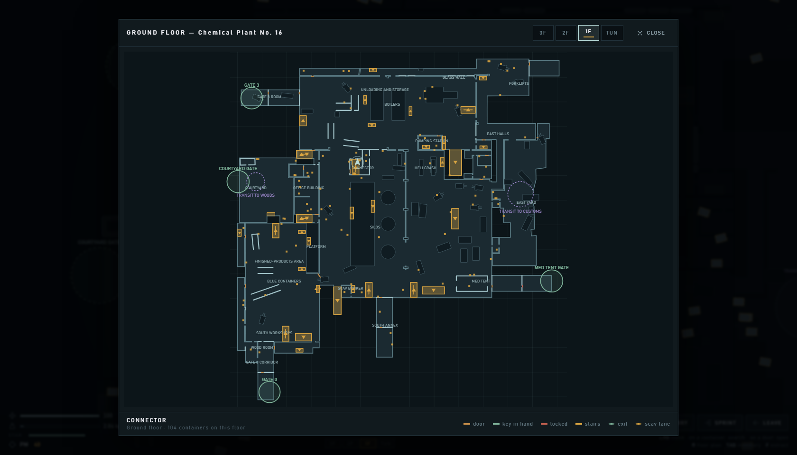
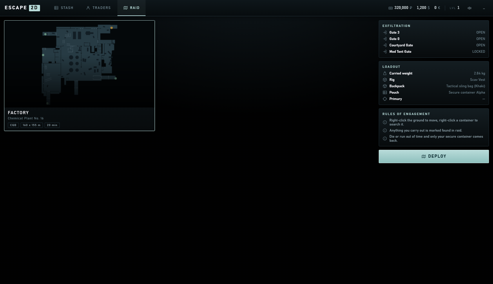
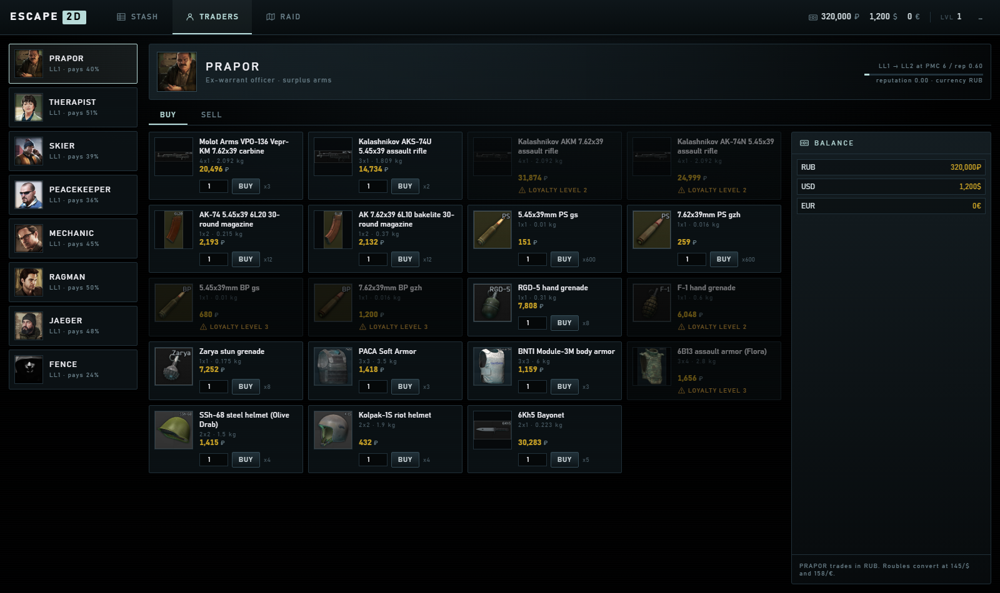
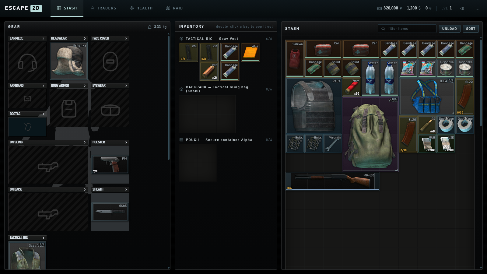

# ESCAPE 2D — Factory

A top-down, browser-based extraction shooter sandbox built around a faithful
reimplementation of Escape From Tarkov's grid inventory. Click to move, click a
container to search it, drag the loot into your rig, then walk to an exfil and
hold the button to take it home. Mouse only — the keyboard is optional.

**Play it: https://ysh4267.github.io/escape-2d/**

No build step, no dependencies — plain ES modules, canvas and DOM.

| | |
|---|---|
|  |  |
| in raid — fog of war over the real Factory geometry | searching a dead scav; unexamined loot shows as `?` |
|  |  |
| the plan of the storey you are on — press `M`, or walk up a staircase and it follows | pre-raid brief |
|  |  |
| eight traders, loyalty-gated stock, three currencies | the stash |

---

## Playing

Everything is playable with the mouse alone.

| | |
|---|---|
| **left click** the ground | move there (A\* pathfinding around the real Factory walls) |
| **left click** a container | walk to it and search it |
| **left click** a hostile | open fire; hold to keep shooting |
| **left click** a door | open it, unlock it if you have the key, or force it |
| **left click** a staircase | walk to it; the prompt offers the floors it reaches |
| **wheel** | zoom |
| **MAP / INVENTORY / SPRINT / LEAVE** buttons | bottom-right of the raid HUD |
| hold the **exfil panel** | channel the extraction |

Optional keyboard shortcuts still work: `TAB` inventory, `M` floor plan,
`SHIFT` sprint, `F` extract, `ESC` leave, `1/2/3` for the hideout tabs.

Doors mostly look after themselves — walk into a shut one and you open it on
the way through. Four on Factory want a key, and one wants a shoulder.

### Inventory

| | |
|---|---|
| **drag** | move an item; the ghost anchors by its **top-left** cell, as in Tarkov |
| **right click while dragging** | rotate 90° (`R` also works; square items are a no-op) |
| **double click** a bag, rig or case | pop it out into a draggable window you can drop items into |
| **double click** anything else | quick transfer |
| **right click** an item | context menu: open, examine, use, split, equip, inspect, discard |
| **ctrl + click** | quick transfer — rig, then pockets, then backpack |
| **ctrl + drag** onto a free cell | split the stack |
| **alt + click** | equip into the matching slot |

Gear and carried storage are separate panels: the doll on the left is where
you dress the character, the inventory panel next to it is where you actually
shuffle loot.

---

## What is modelled

**Grid inventory.** Items occupy `w × h` cells, never overlap, and rotate 90°.
Grid-to-grid drops onto occupied cells are rejected outright — Tarkov has no
grid swap; only equipment slots swap. Stacks merge up to the template's real
`StackMaxSize` and a found-in-raid stack never launders a non-FiR one.

**Containers.** Every container carries its real internal grid layout, so a
BlackRock rig really is seven separate pouches and a Documents case really is
1×2 outside and 4×4 inside, filtered to keys, intel and money. Nesting is
blocked for cycles (an item inside itself), for backpack-in-backpack, and past
a depth cap.

**Equipment.** Headwear, earpiece, face cover, eyewear, body armor, tactical
rig, backpack, secure container, on-sling, on-back, holster and sheath, plus
**four independent 1×1 pockets** — the real base-PMC layout, so nothing larger
than a single cell fits in a pocket and items never span two of them.

**The plant, all four storeys of it.** Tunnels, ground floor, the locker level
and the rafters, each with its own walls, walkable surface, machinery and
staircases, lifted out of the four floor groups in tarkov.dev's vector map.
Thirty-three stairwells link them; a run that shows up on two floor groups is
one staircase seen from both ends, which is how the links are derived rather
than placed. A staircase that passes a floor without a landing does not offer
to stop there.

**Doors, and which of them open.** Nothing hand-places these. The build tool
rasterises each floor exactly as the nav grid does, measures how far every
point is from the nearest solid, then floods the surface widest-first: the
first cell to join two rooms that have both already grown is the narrowest
point of the passage between them. That finds 81 openings across the four
floors, doorways and gateways alike. Anything under 1.6 units of clear width
gets a leaf that starts shut, the way Factory's do.

Which of them are locked is not guesswork either. Factory has exactly four
locked doors, and tarkov.dev's dataset records each one's position and the key
that answers it. Converted into map units, all four land within a metre of an
opening the passage search had already found on its own, knowing nothing about
them — the emergency exit door out to the Med Tent Gate, the cellars door in
the tunnels, the third-floor locked office (all three: **Factory emergency exit
key**) and the TerraGroup storage room beside the camera bunker door
(**TerraGroup storage room keycard**). A key loses a use per door it opens and
breaks when it runs dry.

The fifth special door is the third floor's **breach room**: locked, with no
key anywhere in the game. It is forced, loudly, over a couple of seconds — the
same way it is in the real thing, and the reason the room is called that.

**Floor plan.** `M` opens the plan of the storey you are standing on, drawn
from the same geometry: rooms, named areas, doors coloured by whether they will
open for you, stairwells with the floors they reach, the exits, and every
container you have actually laid eyes on. Walk up a staircase and the plan
follows you; the strip along the top reads any other floor without leaving the
one you are on.

**Raids.** Loot is not scattered. All 167 static containers Factory has are
placed where the game places them, with the type the game gives them, and the
144 loose-loot spots spawn the item recorded for them, some of the time. PMC
insertion uses the map's own 85 player spawn points.

**Searching and examining.** Opening a container does not show you what is in
it. The container is searched, and it gives up its contents **one item at a
time** — matching the real game, where the Attention skill is raised per item
uncovered and its elite perk is a chance to find an item instantly. Nothing you
have not uncovered can be picked up, and walking away cancels the search.

Uncovering an item is not the same as identifying it. 27 of the 195 templates —
keys, rare electronics, high-value gear — are not `ExaminedByDefault`, so they
come out as a hatched **Unknown item** plate. Examining runs on its own timer,
one at a time, and is learned per profile: examine one LEDX and every LEDX you
ever find is recognised. Right-click or double-click to examine.

**Scavs.** Seven hostiles patrol the navmesh and notice you inside a view cone
with clear line of sight, then close to a firing distance and shoot. Your
weapon draws ammunition of the matching caliber from whatever you are carrying,
your armor soaks a share of incoming damage and wears down doing it, and a dead
scav leaves a searchable body with its own gear in it.

**Extraction.** Anything carried into a raid loses its found-in-raid mark on
insertion; anything carried out gains it. Die or run the clock out and only the
secure container comes home. What you carry out stays exactly where you packed
it — the rig, backpack and pouch come home loaded, and emptying them is the
UNLOAD button in the stash rather than something the result screen does for
you.

**Sound.** 178 cues over three buses — world foley, interface, ambience —
covering footsteps by gait, per-material container rummaging, item handling
keyed to what the item *is*, interface and trader clicks, weapon reports,
extraction and death.

The audio is third-party, so it ships sealed: a build step deflates the 195
clips into a single AES-256-GCM container, and only that container is tracked —
196 files and 2143 KiB become one request of 1557 KiB. The page unseals it on
load.
The seal is nominal, not protection: a static site has to carry the key, so it
is right there in the source. What it buys is that the pack is not a folder of
ready-to-play files. Any cue with no sample behind it is a silent no-op.

The mapping follows the game's own taxonomy rather than one invented here:
footsteps are `<gait>_<surface>` layered with a `gear_stereo` webbing rustle,
looting uses all ten of the game's rummage loops, one per material (`woodbox`,
`industrialbox`, `safe`, `drawer_wood`, `drawer_metal`, `cashregister`,
`sportbag`, `techno_box`, `jacket`, body), and item foley comes from each
template's own `ItemSound` value — the field the real game keys off, carried
through into `src/data/items-db.json` by the item builder — so a pill bottle
rattles, a bandage rustles and a helmet lands like a helmet, rather than every
item in a category sharing one guessed sound. Mute lives in the top bar,
volume in the profile panel.

**Traders.** Eight traders with the documented buy-back multipliers — Therapist
0.51, Ragman 0.50, Jaeger 0.48, Mechanic 0.45, Prapor 0.40, Skier 0.39,
Peacekeeper 0.36, Fence 0.24 — category gating so most items have only two or
three legal buyers, loyalty levels gated on PMC level, reputation *and* money
spent, and separate rouble / dollar / euro balances. The screen is laid out
like the in-game one: portrait tabs with the loyalty numeral, the assortment
packed into an item grid with price captions, lock plates over higher-tier
offers and per-restock stock counters.

Both sides of a deal go through the trading table rather than completing on a
click. Picking an offer *stages* it — several can sit on the table at once,
each with its own quantity and line total — then the payment has to be
allocated with **Fill items** before **DEAL!** commits the lot in one
transaction. Selling mirrors it: drag items over, each carries what the trader
will pay for it, then DEAL!. Neither side pops a confirmation; staging is the
confirmation, which is how the real screen works. Unexamined items and
non-empty containers are refused, what the trader will not buy is greyed out,
and the blocked states use the game's own wording. Fence rerolls his stolen
goods for a fee.

---

## Running it

Any static server works:

```sh
python -m http.server 8777
# then open http://127.0.0.1:8777/
```

`file://` will not work — the game loads its data with `fetch`.

---

## Tools

| file | what it does |
|---|---|
| `tools/build_items.py` | builds `src/data/items-db.json` and downloads item artwork |
| `tools/selection.py` | the curated item list the builder resolves |
| `tools/build_map.py` | extracts all four Factory storeys, finds every opening in them, derives the stairwell links, and folds in tarkov.dev's exits / locks / spawns / loot spots — all into `src/data/map-factory.json` |
| `tools/pack_sfx.py` | compresses and seals the sound pack (and `--unpack` reverses it) |
| `tools/sfx_picks.py` | which clip backs which cue |
| `tools/smoke.html` | headless assertion suite over inventory, map, raid, search, examine, trader and save logic |
| `tools/preview_map.html` | `?level=…` renders the raw extracted geometry for one storey |
| `tools/preview_nav.html` | `?level=basement\|ground\|second\|third` — navmesh components, spawn/extract reachability, doors, stairwells and per-area walkability |
| `tools/sfx_test.html` | checks the shipped effects are served and that the audio surface is what the game calls |

Regenerate everything:

```sh
cd tools
python build_items.py --report
python build_map.py
```

The item builder joins three public data sets: grid footprints, weights, stack
sizes and container layouts come from the SPT template dump, English names and
descriptions from the SPT locale dump, base prices and categories from the SPT
handbook, and artwork from `assets.tarkov.dev` — whose grid images are exactly
`63 × cells + 1` pixels, which the builder uses to cross-check every footprint.

---

## Data sources and attribution

This is a non-commercial fan project. Escape From Tarkov is a trademark of
Battlestate Games; this project is not affiliated with or endorsed by them.

- **Map geometry** — [the-hideout/tarkov-dev-svg-maps](https://github.com/the-hideout/tarkov-dev-svg-maps),
  licensed **CC BY-NC-SA 4.0**. All four of Factory's storeys — walls, floors,
  obstacles, reactor units and staircases — are derived from that vector map,
  and so are the openings between them.
- **Raid contents** — `json.tarkov.dev/regular/maps`, the dataset the
  [tarkov.dev](https://tarkov.dev) map page reads. It supplies the exits and
  their factions, the transits, the four locked doors and the key each one
  wants, the 85 player spawn points, the 167 static container spots and the
  144 loose-loot spots, all in the game's own coordinates.
- **Item artwork** — `assets.tarkov.dev`, from the same project.
- **Item templates, names and handbook prices** — the public
  [SPT](https://github.com/sp-tarkov/server) database dumps.
- **What the places are called, and door behaviour** — the Escape From Tarkov
  wiki.
- **Sound effects** — third-party audio whose rights stay with their owner. It
  ships sealed.

Because the map geometry is CC BY-NC-SA, this project inherits the same terms:
share alike, non-commercial, with attribution.

### Disclaimer

That licence covers only what the authors made, not the third-party material
above. The sealed pack is encrypted because its contents are not ours to hand
out; the key is in the source only because the page needs it, and that is not
permission to use it. **Unseal the pack for anything but playing this game, or
reuse and redistribute any of this in any form, and you do so at your own
risk** — clearing the rights is yours to do, and the authors carry no liability
for what follows. Provided as is, without warranty.

Full text in [LICENSE](LICENSE).
